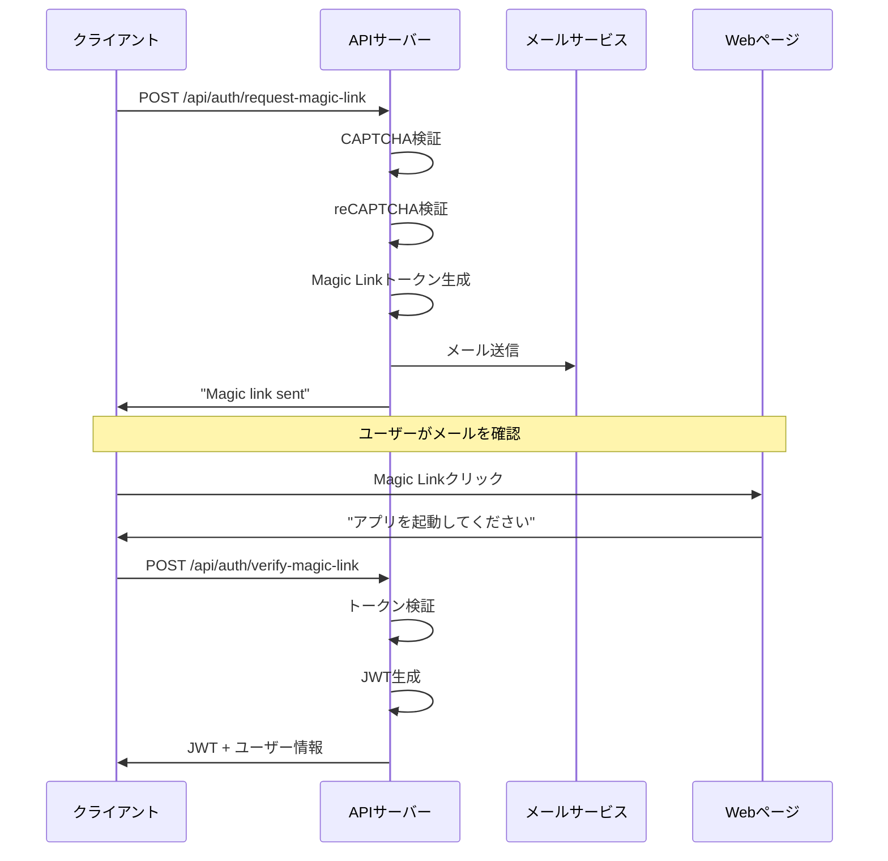
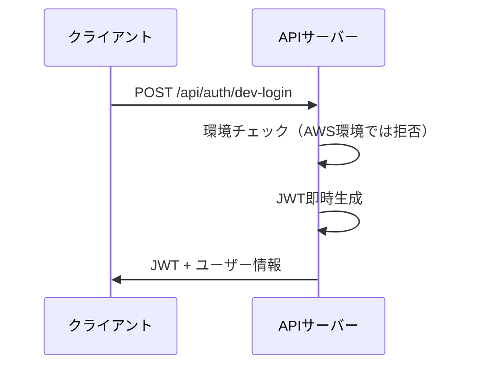
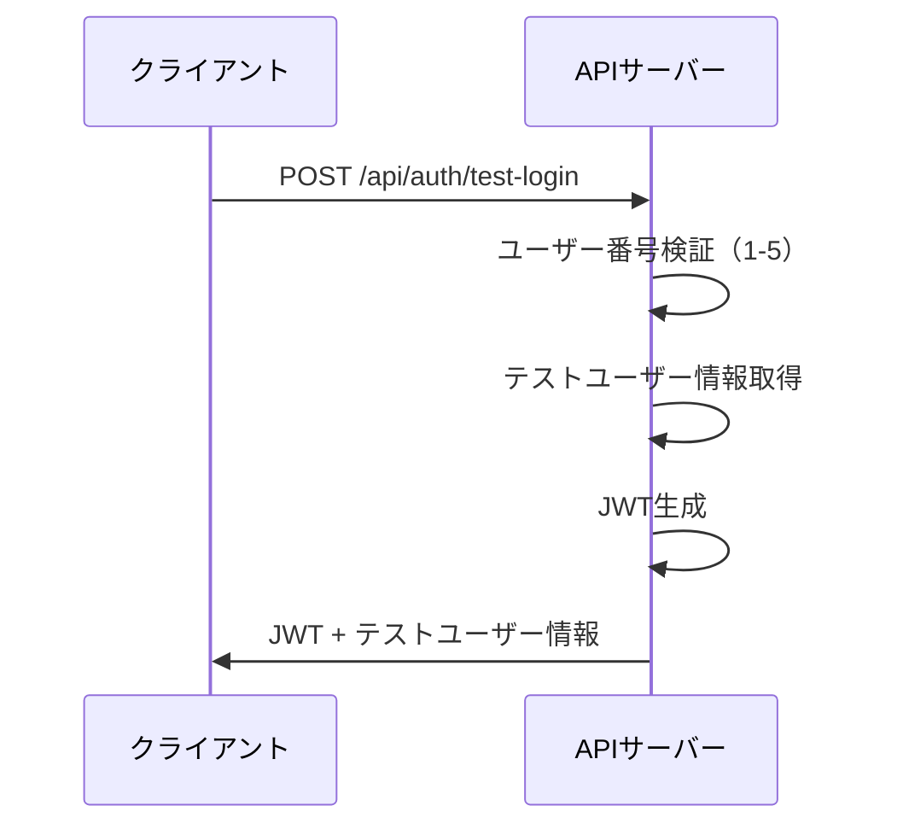

# 認証API仕様書

## 概要

じゃんけんゲームアプリの認証機能を提供するAPI仕様書です。
Magic Link方式による認証を基本とし、環境別の認証レベルを提供します。

## 基本方針

| 項目 | 内容 |
|------|------|
| 認証方式 | Magic Link（メール認証）を基本とする |
| ユーザー識別 | メールアドレスを唯一のIDとして使用 |
| セッション管理 | JWT（JSON Web Token）による認証状態管理 |
| 環境別対応 | 開発/VPS/AWS環境で異なる認証レベルを提供 |
| Bot対策 | じゃんけんCAPTCHA + reCAPTCHA v2による多層防御 |

## 認証フロー

### 1. Magic Link認証フロー（基本）



### 2. 開発用簡易認証フロー（開発/VPS環境のみ）



### 3. テストユーザーログインフロー（開発環境専用）



## API エンドポイント

### 1. Magic Link リクエスト

#### `POST /api/auth/request-magic-link`

Magic Linkをメールで送信します。

**リクエスト**
```json
{
  "email": "user@example.com",
  "captcha": {
    "opponent": "✌️",
    "answer": "✊",
    "token": "captcha_signature_token"
  },
  "recaptcha_token": "03AGdBq24..."
}
```

**パラメータ**
- `email` (string, required): ユーザーのメールアドレス
- `captcha` (object, optional): じゃんけんCAPTCHA情報
  - `opponent` (string): 出題された手（✊/✌️/✋）
  - `answer` (string): ユーザーの選択した手
  - `token` (string): CAPTCHA署名トークン
- `recaptcha_token` (string, VPS/AWS環境で必須): reCAPTCHA v2トークン

**レスポンス（成功）**
```json
{
  "success": true,
  "message": "Magic link sent.",
  "data": {
    "token": "development_token_here"  // 開発環境のみ
  },
  "timestamp": "2024-01-01T00:00:00Z"
}
```

**レスポンス（エラー）**
```json
{
  "success": false,
  "message": "エラーメッセージ",
  "error": {
    "code": "ERROR_CODE",
    "details": "詳細情報"
  },
  "timestamp": "2024-01-01T00:00:00Z"
}
```

**エラーケース**
- `400`: バリデーションエラー（メールアドレス不正、CAPTCHA不正解など）
- `429`: レート制限超過（5分間に5回まで）
- `500`: サーバーエラー

### 2. Magic Link 検証

#### `POST /api/auth/verify-magic-link`

Magic Linkトークンを検証し、JWTを発行します。

**リクエスト**
```json
{
  "token": "magic_link_token_string"
}
```

**パラメータ**
- `token` (string, required): Magic Linkトークン

**レスポンス（成功）**
```json
{
  "success": true,
  "data": {
    "user": {
      "user_id": "uuid_string",
      "email": "user@example.com",
      "nickname": "ニックネーム",
      "profile_image_url": "https://...",
      "title": "称号",
      "alias": "別名"
    },
    "token": "JWT_TOKEN"
  },
  "timestamp": "2024-01-01T00:00:00Z"
}
```

**レスポンス（エラー）**
```json
{
  "success": false,
  "message": "無効なトークンです",
  "error": {
    "code": "INVALID_TOKEN",
    "details": "トークンが無効または期限切れです"
  },
  "timestamp": "2024-01-01T00:00:00Z"
}
```

**エラーケース**
- `400`: トークンが指定されていない
- `401`: トークンが無効または期限切れ
- `500`: サーバーエラー

### 3. 開発用簡易認証

#### `POST /api/auth/dev-login`

開発用の簡易認証でJWTを即時発行します。
AWS環境では無効化されます。

**リクエスト**
```json
{
  "email": "dev@example.com",
  "mode": "dev"
}
```

**パラメータ**
- `email` (string, required): メールアドレス
- `mode` (string, optional): ログインモード（"dev" または "admin"）

**レスポンス（成功）**
```json
{
  "success": true,
  "data": {
    "user": {
      "user_id": "dev_user",
      "email": "dev@example.com",
      "nickname": "開発者",
      "role": "developer",
      "profile_image_url": "https://...",
      "title": "開発者",
      "alias": "コードマスター"
    },
    "token": "JWT_TOKEN"
  },
  "timestamp": "2024-01-01T00:00:00Z"
}
```

**エラーケース**
- `400`: バリデーションエラー
- `401`: AWS環境での実行試行
- `500`: サーバーエラー

### 4. テストユーザーログイン

#### `POST /api/auth/test-login`

開発環境専用の5つのテストユーザーアカウントを使用してログインします。
本番環境（AWS）では無効化されます。

**リクエスト**
```json
{
  "user_number": 1  // 1-5の整数
}
```

**パラメータ**
- `user_number` (integer, required): テストユーザー番号（1-5）

**レスポンス（成功）**
```json
{
  "success": true,
  "data": {
    "user": {
      "user_id": "test_user_1",
      "email": "test1@example.com",
      "nickname": "じゃんけんマスター",
      "profile_image_url": "https://lesson01.myou-kou.com/avatars/defaultAvatar1.png",
      "title": "テストプレイヤー",
      "alias": "じゃんけんテスター"
    },
    "token": "JWT_TOKEN"
  },
  "timestamp": "2024-01-01T00:00:00Z"
}
```

**レスポンス（エラー）**
```json
{
  "success": false,
  "message": "この機能は開発環境でのみ利用可能です",
  "error": {
    "code": "INVALID_ENVIRONMENT",
    "details": "本番環境では利用できません"
  },
  "timestamp": "2024-01-01T00:00:00Z"
}
```

**エラーケース**
- `400`: 無効なユーザー番号
- `403`: 本番環境での実行試行
- `500`: サーバーエラー

### 5. 従来形式ログイン（互換性維持）

#### `POST /api/auth/user-info`

従来のID/パスワード方式ログイン（既存クライアント互換性のため）

**リクエスト**
```json
{
  "userId": "testuser",
  "password": "testpass"
}
```

**レスポンス（成功）**
```json
{
  "success": true,
  "data": {
    "user": {
      "user_id": "testuser",
      "nickname": "テストユーザー",
      "title": "初心者",
      "alias": "じゃんけん戦士",
      "profile_image_url": null
    },
    "token": "JWT_TOKEN"
  },
  "timestamp": "2024-01-01T00:00:00Z"
}
```

### 6. DB連携ログイン

#### `POST /api/auth/db-login`

データベースに保存されたユーザー認証情報を使用したログイン機能

**リクエスト**
```json
{
  "email": "test1@example.com",
  "password": "password123"
}
```

**レスポンス（成功）**
```json
{
  "success": true,
  "data": {
    "user": {
      "user_id": "test_user_1",
      "email": "test1@example.com",
      "nickname": "じゃんけんマスター",
      "profile_image_url": "https://lesson01.myou-kou.com/avatars/defaultAvatar1.png",
      "title": "テストプレイヤー",
      "alias": "じゃんけんテスター"
    },
    "token": "JWT_TOKEN"
  },
  "timestamp": "2024-01-01T00:00:00Z"
}
```

## テストユーザー情報（DB連携版）

### 利用可能なテストユーザー

| ユーザー番号 | ユーザーID | メールアドレス | ニックネーム | パスワード |
|-------------|------------|----------------|--------------|------------|
| 1 | `test_user_1` | `test1@example.com` | じゃんけんマスター | `password123` |
| 2 | `test_user_2` | `test2@example.com` | バトルクイーン | `password123` |
| 3 | `test_user_3` | `test3@example.com` | 勝負師 | `password123` |
| 4 | `test_user_4` | `test4@example.com` | 新米戦士 | `password123` |
| 5 | `test_user_5` | `test5@example.com` | 伝説のプレイヤー | `password123` |

### 環境別の利用制限

| 環境 | テストユーザー利用可否 | 備考 |
|------|----------------------|------|
| 開発環境 | ✓ | 制限なし |
| VPS環境 | ✓ | 開発者IPのみ |
| AWS環境 | ✗ | 完全無効化 |

## 認証・認可

### JWT仕様

**Header**
```json
{
  "alg": "HS256",
  "typ": "JWT"
}
```

**Payload**
```json
{
  "sub": "user_id",
  "email": "user@example.com",
  "nickname": "ニックネーム",
  "role": "user",
  "iat": 1718820000,
  "exp": 1719424800,
  "jti": "jwt_id"
}
```

**有効期限**
- アクセストークン: 15分
- Magic Linkトークン: 24時間
- リフレッシュトークン: 30日

### 環境別認証レベル

| 環境 | Magic Link | 開発用認証 | テストユーザー | reCAPTCHA | レート制限 |
|------|------------|------------|----------------|-----------|------------|
| 開発環境 | ✓ | ✓ | ✓ | オプション | なし |
| VPS環境 | ✓ | ✓ | ✓ | 必須 | 1000req/min |
| AWS環境 | ✓ | ✗ | ✗ | 必須 | 2000req/min |

## Bot対策

### 1. じゃんけんCAPTCHA

**出題例**
```
相手は ✋ を出しています。
勝つためにはどれを出せばいいでしょう？
[✊ グー] [✌️ チョキ] [✋ パー]
```

**実装**
- 3択からランダム出題
- 署名付きトークンで改ざん防止
- 出題時にトークン生成、回答時に検証

### 2. reCAPTCHA v2

- VPS/AWS環境で必須
- チェックボックス形式
- APIリクエスト前にクライアント側で取得

## エラーハンドリング

### 標準エラーレスポンス

```json
{
  "success": false,
  "message": "ユーザー向けエラーメッセージ",
  "error": {
    "code": "ERROR_CODE",
    "details": "詳細情報"
  },
  "timestamp": "2024-01-01T00:00:00Z"
}
```

### エラーコード一覧

| コード | 説明 | HTTPステータス |
|--------|------|----------------|
| `VALIDATION_ERROR` | バリデーションエラー | 400 |
| `INVALID_CAPTCHA` | CAPTCHA不正解 | 400 |
| `INVALID_TOKEN` | 無効なトークン | 401 |
| `RATE_LIMIT_EXCEEDED` | レート制限超過 | 429 |
| `TEST_LOGIN_ERROR` | テストログインエラー | 400 |
| `DB_LOGIN_ERROR` | DBログインエラー | 401 |
| `INTERNAL_SERVER_ERROR` | サーバーエラー | 500 |

## セキュリティ要件

### 1. 通信セキュリティ
- HTTPS通信必須（AWS環境）
- CORS設定による適切なオリジン制限

### 2. トークンセキュリティ
- Magic Linkトークンは24時間で期限切れ
- ワンタイム使用（使用後無効化）
- JWT署名による改ざん防止

### 3. レート制限
- IP単位での制限
- 環境別制限値の適用

### 4. ログ・監査
- 認証試行の詳細ログ
- 不正アクセスの検知・通知
- 環境別ログ保持期間

## 実装例

### クライアント側（Flutter）

```dart
// Magic Link リクエスト
Future<void> requestMagicLink(String email) async {
  final response = await http.post(
    Uri.parse('$baseUrl/api/auth/request-magic-link'),
    headers: {
      'Content-Type': 'application/json',
    },
    body: jsonEncode({
      'email': email,
      'captcha': {
        'opponent': '✌️',
        'answer': '✊',
        'token': captchaToken,
      },
      'recaptcha_token': recaptchaToken,
    }),
  );

  if (response.statusCode == 200) {
    final data = jsonDecode(response.body);
    if (data['success']) {
      // 開発環境ではトークンを直接取得可能
      final token = data['data']?['token'];
      if (token != null) {
        // トークンを保存して検証に使用
        await storage.write(key: 'magic_link_token', value: token);
      }
    }
  }
}

// Magic Link 検証
Future<void> verifyMagicLink(String token) async {
  final response = await http.post(
    Uri.parse('$baseUrl/api/auth/verify-magic-link'),
    headers: {
      'Content-Type': 'application/json',
    },
    body: jsonEncode({'token': token}),
  );

  if (response.statusCode == 200) {
    final data = jsonDecode(response.body);
    if (data['success']) {
      final jwt = data['data']['token'];
      final user = data['data']['user'];
      
      // JWTを保存
      await storage.write(key: 'jwt_token', value: jwt);
      await storage.write(key: 'user_data', value: jsonEncode(user));
    }
  }
}

// テストユーザーログイン
Future<void> loginAsTestUser(int userNumber) async {
  final response = await http.post(
    Uri.parse('$baseUrl/api/auth/test-login'),
    headers: {'Content-Type': 'application/json'},
    body: jsonEncode({'user_number': userNumber}),
  );

  if (response.statusCode == 200) {
    final data = jsonDecode(response.body);
    if (data['success']) {
      final jwt = data['data']['token'];
      final user = data['data']['user'];
      
      // JWTを保存
      await storage.write(key: 'jwt_token', value: jwt);
      await storage.write(key: 'user_data', value: jsonEncode(user));
    }
  }
}

// 開発用ログイン
Future<void> devLogin(String email, String mode) async {
  final response = await http.post(
    Uri.parse('$baseUrl/api/auth/dev-login'),
    headers: {'Content-Type': 'application/json'},
    body: jsonEncode({
      'email': email,
      'mode': mode,
    }),
  );

  if (response.statusCode == 200) {
    final data = jsonDecode(response.body);
    if (data['success']) {
      final jwt = data['data']['token'];
      final user = data['data']['user'];
      
      // JWTを保存
      await storage.write(key: 'jwt_token', value: jwt);
      await storage.write(key: 'user_data', value: jsonEncode(user));
    }
  }
}
```

### サーバー側（FastAPI）

```python
from fastapi import APIRouter, Depends, HTTPException
from typing import Optional
from pydantic import BaseModel

router = APIRouter()

class TestLoginRequest(BaseModel):
    user_number: int

class MagicLinkRequest(BaseModel):
    token: str

@router.post("/test-login")
async def test_login(
    request: TestLoginRequest,
    environment: str = Depends(get_environment)
):
    if environment == "aws":
        raise HTTPException(403, "This feature is not available in production")
    
    if not 1 <= request.user_number <= 5:
        raise HTTPException(400, "Invalid user number")
    
    # テストユーザー情報を返却
    return {
        "success": True,
        "data": {
            "user": TEST_USERS[request.user_number - 1],
            "token": create_jwt_token(TEST_USERS[request.user_number - 1])
        }
    }

@router.post("/verify-magic-link")
async def verify_magic_link(request: MagicLinkRequest):
    token = request.token
    
    # トークン検証
    if not is_valid_magic_link_token(token):
        raise HTTPException(401, "Invalid or expired token")
    
    # ユーザー情報を取得
    user = get_user_from_token(token)
    
    # JWTを生成
    jwt_token = create_jwt_token(user)
    
    return {
        "success": True,
        "data": {
            "user": user,
            "token": jwt_token
        }
    }
```

## 今後の拡張予定

1. **ソーシャルログイン対応**
   - Google OAuth 2.0
   - Apple Sign-In

2. **多要素認証**
   - SMS認証
   - TOTP（Time-based One-Time Password）

3. **セッション管理強化**
   - リフレッシュトークン
   - デバイス管理

4. **セキュリティ強化**
   - デバイスフィンガープリンティング
   - 異常ログイン検知

## 現在の実装状況

- ✅ Magic Link認証（Redis対応）
- ✅ テストユーザーログイン（5ユーザー）
- ✅ 開発用簡易認証
- ✅ 従来形式ログイン（互換性維持）
- ✅ DB連携ログイン
- ✅ JWT管理システム
- ✅ 統一エラーハンドリング
- ✅ 型安全なPydanticスキーマ
- 🔄 メール送信機能（開発環境では直接トークン返却）
- 🔄 本番環境でのCAPTCHA強化

## 注意事項

1. **開発環境専用機能**
   - テストユーザーログインは開発環境でのみ利用可能
   - 本番環境（AWS）では完全に無効化

2. **セキュリティ**
   - 開発環境でも適切な認証が必要
   - テストユーザーのパスワードは安全に管理

3. **環境別設定**
   - 各環境で適切な認証レベルを設定
   - 開発環境と本番環境で異なる動作

この仕様により、開発環境から本番環境まで、段階的にセキュリティレベルを向上させながら、効率的な開発とテストが可能になります。 