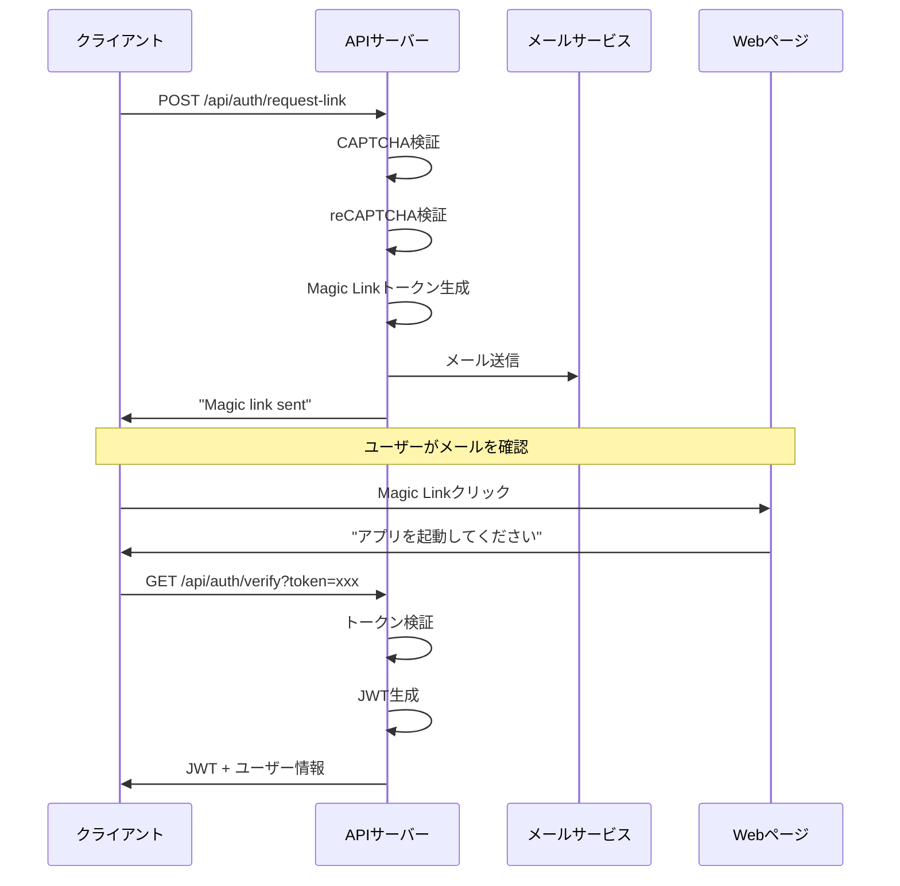
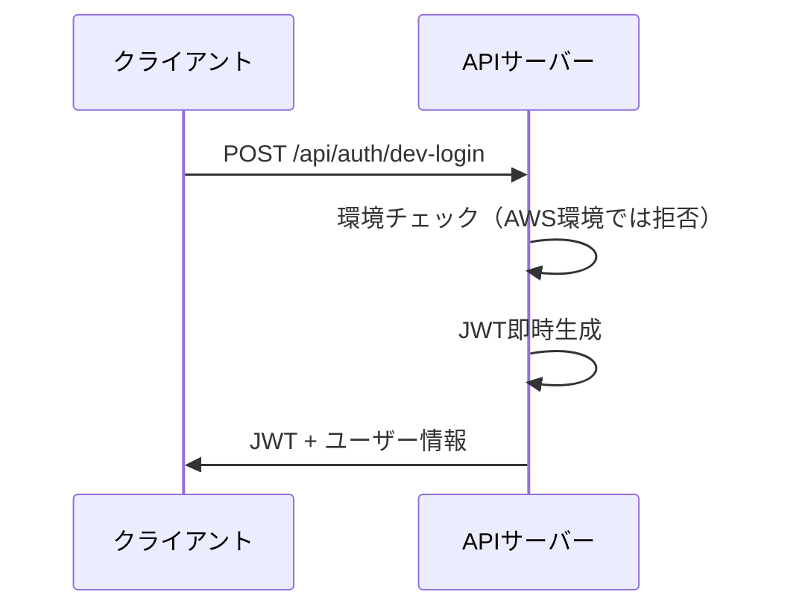

# 認証API仕様書

## 概要

じゃんけんゲームアプリの認証機能を提供するAPI仕様書です。
Magic Link方式による認証を基本とし、環境別の認証レベルを提供します。

## 基本方針

| 項目 | 内容 |
|------|------|
| 認証方式 | Magic Link（メール認証）を基本とする |
| ユーザー識別 | メールアドレスを唯一のIDとして使用 |
| セッション管理 | JWT（JSON Web Token）による認証状態管理 |
| 環境別対応 | 開発/VPS/AWS環境で異なる認証レベルを提供 |
| Bot対策 | じゃんけんCAPTCHA + reCAPTCHA v2による多層防御 |

## 認証フロー

### 1. Magic Link認証フロー（基本）



### 2. 開発用簡易認証フロー（開発/VPS環境のみ）



## API エンドポイント

### 1. Magic Link リクエスト

#### `POST /api/auth/request-link`

Magic Linkをメールで送信します。

**リクエスト**
```json
{
  "email": "user@example.com",
  "captcha": {
    "opponent": "✌️",
    "answer": "✊",
    "token": "captcha_signature_token"
  },
  "recaptcha_token": "03AGdBq24..."
}
```

**パラメータ**
- `email` (string, required): ユーザーのメールアドレス
- `captcha` (object, required): じゃんけんCAPTCHA情報
  - `opponent` (string): 出題された手（✊/✌️/✋）
  - `answer` (string): ユーザーの選択した手
  - `token` (string): CAPTCHA署名トークン
- `recaptcha_token` (string, VPS/AWS環境で必須): reCAPTCHA v2トークン

**レスポンス（成功）**
```json
{
  "success": true,
  "message": "Magic link sent."
}
```

**レスポンス（エラー）**
```json
{
  "success": false,
  "message": "エラーメッセージ",
  "error": {
    "code": "ERROR_CODE",
    "details": "詳細情報"
  }
}
```

**エラーケース**
- `400`: バリデーションエラー（メールアドレス不正、CAPTCHA不正解など）
- `429`: レート制限超過（5分間に5回まで）
- `500`: サーバーエラー

### 2. Magic Link 検証

#### `GET /api/auth/verify?token={token}`

Magic Linkトークンを検証し、JWTを発行します。

**パラメータ**
- `token` (string, required): Magic Linkトークン

**レスポンス（成功）**
```json
{
  "success": true,
  "token": "eyJhbGciOiJIUzI1NiIsInR5cCI6IkpXVCJ9...",
  "user": {
    "email": "user@example.com",
    "role": "user"
  }
}
```

**レスポンス（エラー）**
```json
{
  "success": false,
  "message": "無効なトークンです",
  "error": {
    "code": "INVALID_TOKEN",
    "details": "トークンが無効または期限切れです"
  }
}
```

**エラーケース**
- `400`: トークンが指定されていない
- `401`: トークンが無効または期限切れ
- `500`: サーバーエラー

### 3. 開発用簡易認証

#### `POST /api/auth/dev-login`

開発用の簡易認証でJWTを即時発行します。
AWS環境では無効化されます。

**リクエスト**
```json
{
  "email": "dev@example.com",
  "mode": "dev"
}
```

**パラメータ**
- `email` (string, required): メールアドレス
- `mode` (string, optional): ログインモード（"dev" または "admin"）

**レスポンス（成功）**
```json
{
  "success": true,
  "token": "eyJhbGciOiJIUzI1NiIsInR5cCI6IkpXVCJ9...",
  "user": {
    "email": "dev@example.com",
    "role": "developer"
  }
}
```

**エラーケース**
- `400`: バリデーションエラー
- `401`: AWS環境での実行試行
- `500`: サーバーエラー

### 4. 従来形式ログイン（互換性維持）

#### `POST /api/auth/UserInfo`

従来のID/パスワード方式ログイン（既存クライアント互換性のため）

**リクエスト**
```json
{
  "userId": "testuser",
  "password": "testpass"
}
```

**レスポンス（成功）**
```json
{
  "success": true,
  "user": {
    "user_id": "testuser",
    "nickname": "テストユーザー",
    "title": "初心者",
    "alias": "じゃんけん戦士",
    "profile_image_url": null
  }
}
```

## 認証・認可

### JWT仕様

**Header**
```json
{
  "alg": "HS256",
  "typ": "JWT"
}
```

**Payload**
```json
{
  "email": "user@example.com",
  "role": "user",
  "iat": 1718820000,
  "exp": 1719424800
}
```

**有効期限**
- アクセストークン: 24時間
- Magic Linkトークン: 15分

### 環境別認証レベル

| 環境 | Magic Link | 開発用認証 | reCAPTCHA | レート制限 |
|------|------------|------------|-----------|------------|
| 開発環境 | ✓ | ✓ | オプション | なし |
| VPS環境 | ✓ | ✓ | 必須 | 1000req/min |
| AWS環境 | ✓ | ✗ | 必須 | 2000req/min |

## Bot対策

### 1. じゃんけんCAPTCHA

**出題例**
```
相手は ✋ を出しています。
勝つためにはどれを出せばいいでしょう？
[✊ グー] [✌️ チョキ] [✋ パー]
```

**実装**
- 3択からランダム出題
- 署名付きトークンで改ざん防止
- 出題時にトークン生成、回答時に検証

### 2. reCAPTCHA v2

- VPS/AWS環境で必須
- チェックボックス形式
- APIリクエスト前にクライアント側で取得

## エラーハンドリング

### 標準エラーレスポンス

```json
{
  "success": false,
  "message": "ユーザー向けエラーメッセージ",
  "error": {
    "code": "ERROR_CODE",
    "details": "詳細情報"
  }
}
```

### エラーコード一覧

| コード | 説明 | HTTPステータス |
|--------|------|----------------|
| `VALIDATION_ERROR` | バリデーションエラー | 400 |
| `INVALID_CAPTCHA` | CAPTCHA不正解 | 400 |
| `INVALID_TOKEN` | 無効なトークン | 401 |
| `RATE_LIMIT_EXCEEDED` | レート制限超過 | 429 |
| `INTERNAL_SERVER_ERROR` | サーバーエラー | 500 |

## セキュリティ要件

### 1. 通信セキュリティ
- HTTPS通信必須
- CORS設定による適切なオリジン制限

### 2. トークンセキュリティ
- Magic Linkトークンは15分で期限切れ
- ワンタイム使用（使用後無効化）
- JWT署名による改ざん防止

### 3. レート制限
- IP単位での制限
- 環境別制限値の適用

### 4. ログ・監査
- 認証試行の詳細ログ
- 不正アクセスの検知・通知
- 環境別ログ保持期間

## 実装例

### クライアント側（Flutter）

```dart
// Magic Link リクエスト
final response = await http.post(
  Uri.parse('$baseUrl/api/auth/request-link'),
  headers: {
    'Content-Type': 'application/json',
  },
  body: jsonEncode({
    'email': email,
    'captcha': {
      'opponent': '✌️',
      'answer': '✊',
      'token': captchaToken,
    },
    'recaptcha_token': recaptchaToken,
  }),
);

// Magic Link 検証
final verifyResponse = await http.get(
  Uri.parse('$baseUrl/api/auth/verify?token=$magicToken'),
);

if (verifyResponse.statusCode == 200) {
  final data = jsonDecode(verifyResponse.body);
  final jwt = data['token'];
  // JWTを保存して以降のAPIリクエストで使用
}
```

### サーバー側（FastAPI）

```python
# JWT認証が必要なエンドポイントでの使用
from fastapi import Depends, HTTPException
from fastapi.security import HTTPBearer

security = HTTPBearer()

async def get_current_user(token: str = Depends(security)):
    try:
        payload = jwt.decode(token, SECRET_KEY, algorithms=["HS256"])
        email = payload.get("email")
        if email is None:
            raise HTTPException(status_code=401, detail="Invalid token")
        return {"email": email}
    except JWTError:
        raise HTTPException(status_code=401, detail="Invalid token")

@app.get("/api/protected")
async def protected_endpoint(current_user: dict = Depends(get_current_user)):
    return {"message": f"Hello {current_user['email']}"}
```

## 今後の拡張予定

1. **ソーシャルログイン対応**
   - Google OAuth 2.0
   - Apple Sign-In

2. **多要素認証**
   - SMS認証
   - TOTP（Time-based One-Time Password）

3. **セッション管理強化**
   - リフレッシュトークン
   - デバイス管理

4. **セキュリティ強化**
   - デバイスフィンガープリンティング
   - 異常ログイン検知 

## テストユーザー認証（開発環境専用）

### 1. テストユーザーログイン

#### `POST /api/auth/test-login`

開発環境専用の5つのテストユーザーアカウントを使用してログインします。
本番環境（AWS）では無効化されます。

**リクエスト**
```json
{
    "user_number": 1  // 1-5の整数
}
```

**パラメータ**
- `user_number` (integer, required): テストユーザー番号（1-5）

**レスポンス（成功）**
```json
{
    "success": true,
    "data": {
        "user": {
            "user_id": "test_user_1",
            "email": "test1@example.com",
            "nickname": "テストユーザー1",
            "profile_image_url": "https://lesson01.myou-kou.com/avatars/defaultAvatar1.png",
            "title": "テストプレイヤー",
            "alias": "じゃんけんテスター"
        },
        "token": "JWT_TOKEN"
    }
}
```

**レスポンス（エラー）**
```json
{
    "success": false,
    "message": "この機能は開発環境でのみ利用可能です",
    "error": {
        "code": "INVALID_ENVIRONMENT",
        "details": "本番環境では利用できません"
    }
}
```

**エラーケース**
- `400`: 無効なユーザー番号
- `403`: 本番環境での実行試行
- `500`: サーバーエラー

### 2. テストユーザーデータ仕様

各テストユーザーは以下の情報を持ちます：

```json
{
    "user_id": "test_user_N",  // Nは1-5
    "email": "testN@example.com",
    "nickname": "テストユーザーN",
    "profile_image_url": "https://lesson01.myou-kou.com/avatars/defaultAvatarN.png",
    "title": "テストプレイヤー",
    "alias": "じゃんけんテスターN"
}
```

### 3. 環境別の利用制限

| 環境 | テストユーザー利用可否 | 備考 |
|------|----------------------|------|
| 開発環境 | ✓ | 制限なし |
| VPS環境 | ✓ | 開発者IPのみ |
| AWS環境 | ✗ | 完全無効化 |

## Magic Link認証の拡張仕様

### 1. Magic Linkリクエスト（拡張）

#### `POST /api/auth/magic-link`

Magic Linkをメールで送信します。環境に応じて認証レベルが変化します。

**環境別の要件**

| 環境 | CAPTCHA | reCAPTCHA | レート制限 |
|------|---------|-----------|------------|
| 開発環境 | オプション | 不要 | 無制限 |
| VPS環境 | 必須 | オプション | 5回/5分 |
| AWS環境 | 必須 | 必須 | 5回/5分 |

**メール送信仕様**

1. メールテンプレート
```html
件名: [じゃんけんゲーム] ログインリンク

本文:
こんにちは！

以下のリンクからログインしてください：
{magic_link_url}

このリンクは15分間有効です。
期限切れの場合は、再度ログインリンクを要求してください。

※このメールに心当たりがない場合は、無視してください。
```

2. Magic Link URL形式
```
開発環境: http://localhost:3000/auth/verify?token={token}
VPS環境: https://dev.myou-kou.com/auth/verify?token={token}
AWS環境: https://myou-kou.com/auth/verify?token={token}
```

### 2. Magic Link検証（拡張）

#### `POST /api/auth/verify-magic-link`

Magic Linkトークンを検証し、JWTを発行します。

**リクエスト**
```json
{
    "token": "magic_link_token_string"
}
```

**レスポンス（成功）**
```json
{
    "success": true,
    "data": {
        "user": {
            "user_id": "uuid_string",
            "email": "user@example.com",
            "nickname": "ニックネーム",
            "profile_image_url": "https://...",
            "title": "称号",
            "alias": "別名"
        },
        "token": "JWT_TOKEN"
    }
}
```

**セキュリティ仕様**

1. トークン形式
```
{timestamp}_{email}_{random_string}
```

2. 検証ルール
- タイムスタンプが15分以内
- トークンが未使用
- メールアドレスが有効

3. 使用後の処理
- トークンを使用済みとしてマーク
- 同じメールアドレスの未使用トークンを無効化

## 実装例の更新

### クライアント側（Flutter）

```dart
// テストユーザーログイン
Future<void> loginAsTestUser(int userNumber) async {
  final response = await http.post(
    Uri.parse('$baseUrl/api/auth/test-login'),
    headers: {'Content-Type': 'application/json'},
    body: jsonEncode({'user_number': userNumber}),
  );

  if (response.statusCode == 200) {
    final data = jsonDecode(response.body);
    final jwt = data['data']['token'];
    // JWTを保存
    await storage.write(key: 'jwt_token', value: jwt);
  }
}

// Magic Link検証
Future<void> verifyMagicLink(String token) async {
  final response = await http.post(
    Uri.parse('$baseUrl/api/auth/verify-magic-link'),
    headers: {'Content-Type': 'application/json'},
    body: jsonEncode({'token': token}),
  );

  if (response.statusCode == 200) {
    final data = jsonDecode(response.body);
    final jwt = data['data']['token'];
    // JWTを保存
    await storage.write(key: 'jwt_token', value: jwt);
  }
}
```

### サーバー側（FastAPI）

```python
from fastapi import APIRouter, Depends, HTTPException
from typing import Optional
from pydantic import BaseModel

router = APIRouter()

class TestLoginRequest(BaseModel):
    user_number: int

class MagicLinkRequest(BaseModel):
    token: str

@router.post("/test-login")
async def test_login(
    request: TestLoginRequest,
    environment: str = Depends(get_environment)
):
    if environment == "aws":
        raise HTTPException(403, "This feature is not available in production")
    
    if not 1 <= request.user_number <= 5:
        raise HTTPException(400, "Invalid user number")
    
    # テストユーザー情報を返却
    return {
        "success": True,
        "data": {
            "user": TEST_USERS[request.user_number - 1],
            "token": create_jwt_token(TEST_USERS[request.user_number - 1])
        }
    }

@router.post("/verify-magic-link")
async def verify_magic_link(request: MagicLinkRequest):
    token = request.token
    
    # トークン検証
    if not is_valid_magic_link_token(token):
        raise HTTPException(401, "Invalid or expired token")
    
    # ユーザー情報を取得
    user = get_user_from_token(token)
    
    # JWTを生成
    jwt_token = create_jwt_token(user)
    
    return {
        "success": True,
        "data": {
            "user": user,
            "token": jwt_token
        }
    }
``` 