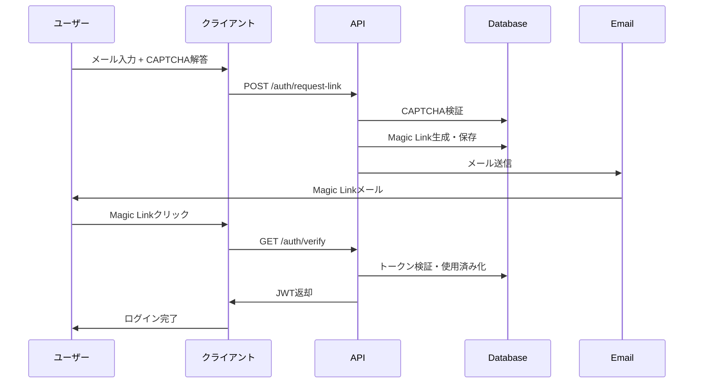

# データベース仕様書（Magic Link認証対応版）

## 概要
本システムはMySQLデータベースを使用し、Magic Link方式による認証システムを採用しています。
ユーザーはメールアドレスのみでアカウント作成・ログインが可能で、パスワードレス認証を実現しています。

## テーブル一覧

### 既存テーブル（ゲーム機能）
- **users**：ユーザー情報  
- **user_stats**：ユーザー統計（勝敗記録等）
- **match_history**：マッチング結果（履歴）  
- **daily_ranking**：デイリーランキング  
- **registration_itemdata**：ユーザー端末識別情報  
- **user_logs**：ユーザー操作ログ  
- **admin_logs**：管理者オペレーションログ  

### 認証関連テーブル（Magic Link対応）
- **magic_links**：Magic Link認証トークン管理 ⭐NEW
- **captcha_challenges**：じゃんけんCAPTCHA + reCAPTCHA管理 ⭐NEW  
- **rate_limits**：レート制限管理 ⭐NEW
- **sessions**：セッション管理  
- **refresh_tokens**：リフレッシュトークン管理  
- **security_events**：セキュリティイベント記録  
- **login_attempts**：ログイン試行記録  
- **two_factor_auth**：2要素認証設定  

### 将来的な拡張用テーブル
- **oauth_accounts**：OAuth連携アカウント（2025-06現在未使用）  

---

## Magic Link認証関連テーブル詳細

### 1. magic_links（Magic Link認証トークン管理）⭐NEW
Magic Link認証で使用するワンタイムトークンを管理するテーブル

| カラム名 | 物理名 | 型 | NULL許可 | デフォルト | 説明 |
|---------|--------|-----|----------|------------|------|
| ID | id | BIGINT AUTO_INCREMENT | NO (PK) | | 主キー |
| トークンハッシュ | token_hash | VARCHAR(255) | NO | | Magic Linkトークンのハッシュ値 |
| メールアドレス | email | VARCHAR(255) | NO | | 送信先メールアドレス |
| 有効期限 | expires_at | DATETIME | NO | | トークン有効期限（15分） |
| 使用済みフラグ | used | BOOLEAN | NO | FALSE | 使用済み状態 |
| 使用日時 | used_at | DATETIME | YES | | 使用された日時 |
| 作成日時 | created_at | DATETIME | NO | CURRENT_TIMESTAMP | 作成日時 |

#### インデックス
- **idx_magic_links_token_hash**: (token_hash) UNIQUE
- **idx_magic_links_email**: (email)
- **idx_magic_links_expires_at**: (expires_at)

#### 機能
- トークンは15分間有効
- ワンタイム使用（used=trueになると再利用不可）
- 期限切れトークンは定期的にクリーンアップ

### 2. captcha_challenges（CAPTCHA管理）⭐NEW
じゃんけんCAPTCHA + Google reCAPTCHA v2の管理用テーブル

| カラム名 | 物理名 | 型 | NULL許可 | デフォルト | 説明 |
|---------|--------|-----|----------|------------|------|
| ID | id | BIGINT AUTO_INCREMENT | NO (PK) | | 主キー |
| チャレンジトークン | challenge_token | VARCHAR(255) | NO | | CAPTCHA署名付きトークン |
| 質問データ | question_data | JSON | NO | | じゃんけん問題の詳細 |
| 正解 | correct_answer | VARCHAR(20) | NO | | 正解の手（rock/paper/scissors） |
| 有効期限 | expires_at | DATETIME | NO | | チャレンジ有効期限（5分） |
| 使用済みフラグ | used | BOOLEAN | NO | FALSE | 使用済み状態 |
| reCAPTCHAトークン | recaptcha_token | VARCHAR(500) | YES | | Google reCAPTCHAトークン |
| reCAPTCHA検証結果 | recaptcha_verified | BOOLEAN | NO | FALSE | reCAPTCHA検証成功フラグ |
| 作成日時 | created_at | DATETIME | NO | CURRENT_TIMESTAMP | 作成日時 |

#### インデックス
- **idx_captcha_challenge_token**: (challenge_token) UNIQUE
- **idx_captcha_expires_at**: (expires_at)

#### question_dataの構造例
```json
{
  "opponent_hand": "✌️",
  "opponent_hand_name": "scissors",
  "question": "相手がチョキを出しています。勝つ手を選んでください",
  "choices": [
    {"value": "rock", "display": "✊ グー"},
    {"value": "paper", "display": "✋ パー"},
    {"value": "scissors", "display": "✌️ チョキ"}
  ]
}
```

### 3. rate_limits（レート制限管理）⭐NEW
IP・エンドポイント単位でのレート制限を管理するテーブル

| カラム名 | 物理名 | 型 | NULL許可 | デフォルト | 説明 |
|---------|--------|-----|----------|------------|------|
| ID | id | BIGINT AUTO_INCREMENT | NO (PK) | | 主キー |
| IPアドレス | ip_address | VARCHAR(45) | NO | | クライアントのIPアドレス |
| エンドポイント | endpoint | VARCHAR(100) | NO | | APIエンドポイント |
| リクエスト数 | request_count | INT | NO | 0 | 現在のリクエスト数 |
| ウィンドウ開始時間 | window_start | DATETIME | NO | | レート制限ウィンドウの開始時間 |
| 最終リクエスト時間 | last_request_at | DATETIME | NO | CURRENT_TIMESTAMP | 最後のリクエスト時間 |

#### インデックス
- **idx_rate_limits_ip_endpoint**: (ip_address, endpoint) UNIQUE
- **idx_rate_limits_window_start**: (window_start)

#### レート制限設定例
- `/auth/request-link`: 5分間に5回まで
- `/auth/verify`: 1分間に10回まで
- `/auth/captcha`: 1分間に20回まで

---

## 既存テーブル詳細

### 4. users（ユーザー情報）

**Magic Link認証対応により、以下の変更が加えられました：**
- `password`フィールドは使用せず（NULL許可）
- `email`フィールドが必須かつユニーク
- 新規ユーザーは`register_type='magic_link'`で作成

| 論理名             | カラム名                 | データ型                | NOT NULL | デフォルト                                      | 備考                                       |
|------------------|------------------------|------------------------|-----------|-----------------------------------------------|------------------------------------------|
| 管理コード          | management_code        | BIGINT AUTO_INCREMENT  | YES (PK)  |                                               | 主キー、自動採番                              |
| ユーザーID         | user_id                | VARCHAR(36)            | YES       |                                               | 一意識別子（UUID）                           |
| 電子メール          | email                  | VARCHAR(255)           | **YES**   |                                               | **Magic Link認証で必須・ユニーク**             |
| パスワード          | password               | VARCHAR(255)           | NO        |                                               | Magic Link認証では未使用                      |
| 名前              | name                   | VARCHAR(50)            | NO        |                                               |                                             |
| ニックネーム        | nickname               | VARCHAR(50)            | YES       |                                               | **必須項目**                               |
| 郵便番号           | postal_code            | VARCHAR(10)            | NO        |                                               |                                             |
| 住所              | address                | VARCHAR(255)           | NO        |                                               |                                             |
| 電話番号           | phone_number           | VARCHAR(15)            | NO        |                                               |                                             |
| 学校名            | university             | VARCHAR(100)           | NO        |                                               |                                             |
| 生年月日           | birthdate              | DATE                   | NO        |                                               |                                             |
| プロフィール写真URL  | profile_image_url      | VARCHAR(255)           | YES       |                                               | **NOT NULL制約**                          |
| 学生証イメージURL    | student_id_image_url   | VARCHAR(255)           | YES       |                                               | **NOT NULL制約**                          |
| 生成日            | created_at             | DATETIME               | NO        | CURRENT_TIMESTAMP                             | レコード作成日時                                 |
| 更新日            | updated_at             | DATETIME               | NO        | CURRENT_TIMESTAMP ON UPDATE CURRENT_TIMESTAMP | レコード更新日時                                 |
| 登録種別           | register_type          | VARCHAR(20)            | NO        | **'magic_link'**                              | magic_link / google / line / apple           |
| 学生証編集可能      | is_student_id_editable | TINYINT                | NO        | 0                                             | 0: 編集不可、1: 編集可                          |
| BAN状態          | is_banned              | TINYINT                | NO        | 0                                             | 0:未設定、1:設定、2:復帰                        |

#### インデックス
- **idx_user_id**: (user_id)
- **idx_email**: (email) UNIQUE ⭐NEW

#### Magic Link認証での新規ユーザー作成
新規ユーザーは以下のデフォルト値で作成されます：
- `nickname`: メールアドレスのローカル部分
- `profile_image_url`: ランダムなデフォルトアバター
- `student_id_image_url`: デフォルト学生証画像
- `register_type`: 'magic_link'

### 5. user_stats（ユーザー統計）

Magic Link認証で新規作成されたユーザーには、初期統計データが自動で作成されます。

| 論理名               | カラム名                      | データ型    | NOT NULL | デフォルト      | 備考                                               |
|--------------------|------------------------------|-----------|-----------|----------------|--------------------------------------------------|
| 管理コード             | management_code             | BIGINT    | YES (PK)  |                | 主キー（外部キー）                                     |
| ユーザーID            | user_id                     | VARCHAR(36) | YES     |                | ユーザー識別子                                        |
| 通算勝利数            | total_wins                  | INT       | NO        | 0              | 通算の勝利数                                           |
| 現在の連勝数          | current_win_streak          | INT       | NO        | 0              | 現在の連勝数                                           |
| 最大連勝数            | max_win_streak              | INT       | NO        | 0              | 記録された最大連勝数                                       |
| グーの出数           | hand_stats_rock             | INT       | NO        | 0              | グーの出数                                             |
| チョキの出数          | hand_stats_scissors         | INT       | NO        | 0              | チョキの出数                                            |
| パーの出数           | hand_stats_paper            | INT       | NO        | 0              | パーの出数                                             |
| お気に入りの手         | favorite_hand               | VARCHAR(10) | YES     | NULL           | 最も多く出した手（例：'rock'）                                |
| 直近の5手と勝敗        | recent_hand_results_str     | VARCHAR(255) | NO      | ''             | 例："G:W,P:D,S:L"（グー勝ち、パーあいこ、チョキ負け）               |
| 当日勝利数            | daily_wins                  | INT       | NO        | 0              | 当日の勝利数                                           |
| 当日敗北数            | daily_losses                | INT       | NO        | 0              | 当日の敗北数                                           |
| 当日引き分け数         | daily_draws                 | INT       | NO        | 0              | 当日の引き分け数                                         |
| 称号                | title                       | VARCHAR(50) | NO      | ''             | 現在表示中の称号                                         |
| 称号リスト             | available_titles            | VARCHAR(255) | NO     | ''             | 獲得済み称号IDのCSV（例: 'title_001,title_003'）               |
| 二つ名               | alias                       | VARCHAR(50) | NO      | ''             | 現在表示中の二つ名                                         |
| 称号表示              | show_title                  | BOOLEAN   | NO        | TRUE           | 称号を他者に見せるか                                      |
| 二つ名表示            | show_alias                  | BOOLEAN   | NO        | TRUE           | 二つ名を他者に見せるか                                     |
| ユーザーランク         | user_rank                   | VARCHAR(20) | NO      | 'no_rank'      | 表示・報酬用のランク                                      |
| リセット日           | last_reset_at              | DATE      | YES       |                | 日次リセット日時                                         |

#### 主キー
- management_code

#### 外部キー
- management_code → users(management_code)

### 6. match_history（マッチング結果）
じゃんけん対戦の結果履歴を管理するテーブル

| カラム名       | 物理名              | 型                           | NULL許可 | デフォルト                   | 説明                                     |
|--------------|--------------------|----------------------------|---------|----------------------------|----------------------------------------|
| 戦い番号       | fight_no           | BIGINT AUTO_INCREMENT      | NO (PK) |                            | 対戦一意ID                                 |
| ユーザー１番    | player1_id         | VARCHAR(36)                | NO      |                            | プレイヤー1のユーザーID                      |
| ユーザー２番    | player2_id         | VARCHAR(36)                | NO      |                            | プレイヤー2のユーザーID                      |
| プレイヤー1ニックネーム | player1_nickname  | VARCHAR(50)              | YES     |                            | プレイヤー1のニックネーム                      |
| プレイヤー2ニックネーム | player2_nickname  | VARCHAR(50)              | YES     |                            | プレイヤー2のニックネーム                      |
| プレイヤー1の手  | player1_hand       | ENUM('rock','paper','scissors') | NO      |                            | プレイヤー1が出した手                         |
| プレイヤー2の手  | player2_hand       | ENUM('rock','paper','scissors') | NO      |                            | プレイヤー2が出した手                         |
| プレイヤー1結果  | player1_result     | ENUM('win','lose','draw')   | NO      |                            | プレイヤー1の対戦結果                         |
| プレイヤー2結果  | player2_result     | ENUM('win','lose','draw')   | NO      |                            | プレイヤー2の対戦結果                         |
| 勝者           | winner            | TINYINT UNSIGNED            | NO      | 0                          | 0:未決、1:player1勝利、2:player2勝利、3:引き分け |
| 引き分け回数     | draw_count        | INT                         | NO      | 0                          | 引き分け回数                                |
| マッチングタイプ  | match_type        | ENUM('random','friend')     | NO      |                            | マッチング方式                              |
| 生成日時        | created_at        | DATETIME(3)                 | NO      | CURRENT_TIMESTAMP(3)       | 対戦生成日時                               |
| 確定日時        | finished_at       | DATETIME(3)                 | YES     |                            | 対戦確定日時                               |

#### インデックス
- **idx_p1**: (player1_id)  
- **idx_p2**: (player2_id)  
- **idx_p1_result**: (player1_id, player1_result)  
- **idx_p2_result**: (player2_id, player2_result)  

### 7. daily_ranking（デイリーランキング）

| 論理名        | カラム名          | データ型     | NOT NULL | デフォルト                                      | 備考             |
|-------------|------------------|------------|-----------|-----------------------------------------------|----------------|
| ランキング順位   | ranking_position | INT        | YES (PK)  |                                               | 主キー           |
| ユーザーID    | user_id          | VARCHAR(36) | YES       |                                               |                 |
| 勝利数       | wins             | INT        | NO        |                                               | NULL許可         |
| 最終勝利日時   | last_win_at      | DATETIME   | NO        |                                               |                 |
| 更新日時     | updated_at       | DATETIME   | NO        | CURRENT_TIMESTAMP ON UPDATE CURRENT_TIMESTAMP | 更新自動更新       |

### 8. registration_itemdata（ユーザー端末識別情報）
ユーザーが利用する端末情報を管理するテーブル

| カラム名         | 物理名           | 型             | NULL許可    | デフォルト | 説明                         |
|----------------|----------------|---------------|-----------|----------|----------------------------|
| ユーザー管理番号   | management_code | BIGINT        | NO (PK)   |          | ユーザー管理コード               |
| 枝番            | subnum         | INT           | NO (PK)   | 1        | 同一ユーザー内での連番            |
| デバイス種       | itemtype       | TINYINT       | NO        | 0        | 0:スマホ以外,1:iOS,2:Android |
| デバイス識別ID    | itemid         | DATETIME      | NO        |          | 端末固有識別子                  |
| 作成日時        | created_at     | DATETIME      | NO        | CURRENT_TIMESTAMP | 作成日時                      |

#### 主キー
- (management_code, subnum)  

#### 外部キー
- management_code → users(management_code)  

### 9. user_logs（ユーザー操作ログ）
ユーザーの操作イベントを時系列で記録するテーブル

| カラム名         | 物理名            | 型                    | NULL許可 | デフォルト | 説明                                |
|----------------|------------------|-----------------------|---------|----------|-----------------------------------|
| ログID         | log_id           | BIGINT AUTO_INCREMENT | NO (PK) |          | ログID（主キー）                         |
| ユーザーID      | user_id          | VARCHAR(36)           | NO      | ''       | ユーザー無関係通知時は空文字             |
| 操作コード      | operation_code   | VARCHAR(10)           | YES     |          | 操作コード                             |
| 操作           | operation        | VARCHAR(100)          | YES     |          | 操作内容                               |
| 詳細           | details          | TEXT                  | YES     |          | 詳細説明                               |
| 操作日時        | operated_at      | DATETIME              | NO      | CURRENT_TIMESTAMP | 操作日時                     |

#### インデックス
- **idx_user_logs_uid**: (user_id)  

### 10. admin_logs（管理者オペレーションログ）
管理者の操作履歴を記録するテーブル

| カラム名      | 型                    | NULL許可 | デフォルト            | 説明                       |
|-------------|-----------------------|---------|-----------------------|--------------------------|
| log_id      | BIGINT AUTO_INCREMENT | NO (PK) |                       | ログID（主キー）              |
| admin_user  | VARCHAR(50)           | NO      |                       | 管理者ユーザー名             |
| operation   | VARCHAR(100)          | NO      |                       | 操作内容                   |
| target_id   | VARCHAR(36)           | NO      |                       | 対象エンティティID           |
| details     | TEXT                  | YES     |                       | 詳細                       |
| operated_at | DATETIME              | NO      | CURRENT_TIMESTAMP     | 操作日時                   |

---

## 認証・セキュリティ関連テーブル

### 11. sessions（セッション管理）
ユーザーセッション管理用。JWT + Redis でのセッション管理を補完し、デバイスごとの詳細な制御を実現。

| カラム名 | 物理名 | 型 | NULL許可 | デフォルト | 説明 |
|---------|--------|-----|----------|------------|------|
| セッションID | session_id | VARCHAR(128) | NO (PK) | | セッション一意識別子 |
| ユーザーID | user_id | VARCHAR(36) | NO | | ユーザー識別子 |
| アクセストークン | access_token | VARCHAR(512) | NO | | JWTアクセストークン |
| リフレッシュトークン | refresh_token | VARCHAR(512) | NO | | JWTリフレッシュトークン |
| デバイスID | device_id | VARCHAR(128) | NO | | 端末識別子 |
| 有効期限 | expires_at | DATETIME | NO | | セッション有効期限 |
| 最終アクティビティ | last_activity | DATETIME | NO | | 最終アクセス日時 |
| IPアドレス | ip_address | VARCHAR(45) | NO | | アクセス元IP |
| ユーザーエージェント | user_agent | VARCHAR(255) | YES | | ブラウザ情報 |
| 作成日時 | created_at | DATETIME | NO | CURRENT_TIMESTAMP | |
| 更新日時 | updated_at | DATETIME | NO | CURRENT_TIMESTAMP | |

#### インデックス
- **idx_sessions_user_id**: (user_id)
- **idx_sessions_device_id**: (device_id)

### 12. refresh_tokens（リフレッシュトークン管理）
リフレッシュトークンの管理とセキュリティ制御用。明示的な失効管理とセキュリティ監査に使用。

| カラム名 | 物理名 | 型 | NULL許可 | デフォルト | 説明 |
|---------|--------|-----|----------|------------|------|
| トークンID | token_id | VARCHAR(128) | NO (PK) | | トークン一意識別子 |
| ユーザーID | user_id | VARCHAR(36) | NO | | ユーザー識別子 |
| トークンハッシュ | refresh_token_hash | VARCHAR(512) | NO | | トークンのハッシュ値 |
| デバイスID | device_id | VARCHAR(128) | NO | | 端末識別子 |
| 発行日時 | issued_at | DATETIME | NO | | トークン発行日時 |
| 有効期限 | expires_at | DATETIME | NO | | トークン有効期限 |
| 失効フラグ | revoked | BOOLEAN | NO | FALSE | 失効状態 |
| 失効理由 | revoked_reason | VARCHAR(100) | YES | | 失効理由 |
| 作成日時 | created_at | DATETIME | NO | CURRENT_TIMESTAMP | |

#### インデックス
- **idx_refresh_tokens_user_id**: (user_id)

### 13. security_events（セキュリティイベント）
セキュリティ関連イベントの記録用。不正アクセスの検知、監査ログ、ユーザーサポート用。

| カラム名 | 物理名 | 型 | NULL許可 | デフォルト | 説明 |
|---------|--------|-----|----------|------------|------|
| イベントID | event_id | BIGINT | NO (PK) | | イベント一意識別子 |
| ユーザーID | user_id | VARCHAR(36) | NO | | ユーザー識別子 |
| イベントタイプ | event_type | VARCHAR(50) | NO | | イベントの種類 |
| ステータス | status | VARCHAR(20) | NO | | イベントの結果 |
| IPアドレス | ip_address | VARCHAR(45) | NO | | アクセス元IP |
| デバイス情報 | device_info | JSON | YES | | デバイスの詳細情報 |
| 作成日時 | created_at | DATETIME | NO | CURRENT_TIMESTAMP | |

#### インデックス
- **idx_security_events_user_id**: (user_id)
- **idx_security_events_created_at**: (created_at)

### 14. login_attempts（ログイン試行）
ログイン試行の記録と制限用。レート制限、ブルートフォース攻撃対策用。

| カラム名 | 物理名 | 型 | NULL許可 | デフォルト | 説明 |
|---------|--------|-----|----------|------------|------|
| 試行ID | attempt_id | BIGINT | NO (PK) | | 試行一意識別子 |
| ユーザーID | user_id | VARCHAR(36) | NO | | ユーザー識別子 |
| IPアドレス | ip_address | VARCHAR(45) | NO | | アクセス元IP |
| 試行日時 | attempt_time | DATETIME | NO | CURRENT_TIMESTAMP | 試行日時 |
| 成功フラグ | success | BOOLEAN | NO | FALSE | 成功/失敗 |
| 失敗理由 | failure_reason | VARCHAR(100) | YES | | 失敗の理由 |

#### インデックス
- **idx_login_attempts_user_id**: (user_id)
- **idx_login_attempts_ip**: (ip_address)
- **idx_login_attempts_time**: (attempt_time)

### 15. two_factor_auth（2要素認証）
2要素認証（2FA）の設定と管理用。TOTP方式での追加認証レイヤーを提供。

| カラム名 | 物理名 | 型 | NULL許可 | デフォルト | 説明 |
|---------|--------|-----|----------|------------|------|
| ユーザーID | user_id | VARCHAR(36) | NO (PK) | | ユーザー識別子 |
| 有効フラグ | enabled | BOOLEAN | NO | FALSE | 2FA有効/無効 |
| 秘密鍵 | secret_key | VARCHAR(32) | NO | | TOTP用の秘密鍵（暗号化） |
| バックアップコード | backup_codes | JSON | YES | | リカバリーコード（暗号化） |
| 最終使用日時 | last_used | DATETIME | YES | | 最後に使用された日時 |
| 作成日時 | created_at | DATETIME | NO | CURRENT_TIMESTAMP | |
| 更新日時 | updated_at | DATETIME | NO | CURRENT_TIMESTAMP | |

### 16. oauth_accounts（OAuth連携アカウント）
将来的なGoogle/LINE/Apple等のOAuth認証連携用。現時点（2025-06）では未使用。

| カラム名 | 物理名 | 型 | NULL許可 | デフォルト | 説明 |
|---------|--------|-----|----------|------------|------|
| OAuth ID | oauth_id | VARCHAR(128) | NO (PK) | | OAuth連携ID |
| ユーザーID | user_id | VARCHAR(36) | NO | | ユーザー識別子 |
| プロバイダー | provider | VARCHAR(20) | NO | | 認証プロバイダー名 |
| プロバイダーユーザーID | provider_user_id | VARCHAR(255) | NO | | プロバイダー側のID |
| アクセストークン | access_token | TEXT | YES | | プロバイダーのトークン |
| リフレッシュトークン | refresh_token | TEXT | YES | | プロバイダーのリフレッシュトークン |
| トークン有効期限 | token_expires_at | DATETIME | YES | | プロバイダートークンの有効期限 |
| プロフィールデータ | profile_data | JSON | YES | | プロバイダーから取得した情報 |
| 作成日時 | created_at | DATETIME | NO | CURRENT_TIMESTAMP | |
| 更新日時 | updated_at | DATETIME | NO | CURRENT_TIMESTAMP | |

---

## Magic Link認証フロー

### 1. Magic Link認証の全体フロー


### 2. データベース操作の流れ

#### 新規ユーザー登録時
1. `captcha_challenges`テーブルでCAPTCHA検証
2. `rate_limits`テーブルでレート制限チェック
3. `magic_links`テーブルにトークン作成
4. メール送信後、ユーザーがリンククリック
5. `magic_links`からトークン検証
6. `users`テーブルに新規ユーザー作成
7. `user_stats`テーブルに初期統計作成
8. `sessions`テーブルにセッション作成

#### 既存ユーザーログイン時
1. `captcha_challenges`テーブルでCAPTCHA検証
2. `rate_limits`テーブルでレート制限チェック
3. `magic_links`テーブルにトークン作成
4. メール送信後、ユーザーがリンククリック
5. `magic_links`からトークン検証
6. `users`テーブルから既存ユーザー取得
7. `sessions`テーブルでセッション更新

### 3. セキュリティ機能

#### レート制限
- IP単位での同一エンドポイントへのアクセス制限
- `rate_limits`テーブルで管理
- 設定例：Magic Link要求は5分間に5回まで

#### CAPTCHA検証
- じゃんけんCAPTCHA + Google reCAPTCHA v2のダブル検証
- `captcha_challenges`テーブルで問題と回答を管理
- 署名付きトークンで改ざん防止

#### トークン管理
- Magic Linkトークンは15分で有効期限切れ
- ワンタイム使用後は`used=true`で無効化
- 定期的なクリーンアップ処理で期限切れデータ削除

---

## 運用・保守

### 定期メンテナンス

#### 日次処理
- 期限切れ`magic_links`レコードの削除
- 期限切れ`captcha_challenges`レコードの削除
- `rate_limits`テーブルの古いレコード削除

#### 週次処理
- セキュリティログの分析
- 不正アクセス試行の監視

#### 月次処理
- ユーザー統計の集計
- データベースのインデックス最適化

### バックアップ戦略
- 日次：完全バックアップ
- 時間毎：トランザクションログバックアップ
- 認証関連テーブルは特に重要なため、追加の冗長化を実施

### 監視項目
- Magic Link生成エラー率
- CAPTCHA失敗率
- レート制限発動頻度
- 異常なアクセスパターンの検知

---

## 重要な注意事項

### 1. profile_image_url と student_id_image_url
- **NOT NULL制約**：これらのフィールドは`NOT NULL`です
- デフォルト画像URLを設定する必要があります
- 実際のシードデータでは以下のデフォルト値が使用されています：
  - `profile_image_url`: `'https://lesson01.myou-kou.com/avatars/defaultAvatar[1-18].png'`
  - `student_id_image_url`: `'https://lesson01.myou-kou.com/avatars/defaultStudentId.png'`

### 2. user_statsテーブル
- `management_code`が主キーです
- `user_id`フィールドも存在しますが、これは参照用です
- JOINクエリでは`users.management_code = user_stats.management_code`を使用します

### 3. 文字エンコーディング
- 全テーブルで`ENGINE=InnoDB DEFAULT CHARSET=utf8mb4 COLLATE=utf8mb4_unicode_ci`が設定されています

### 4. Magic Link認証でのユーザー作成
- 新規ユーザーは`register_type='magic_link'`で作成
- `email`フィールドは必須かつユニーク制約
- `password`フィールドは使用しないためNULL許可
- 初期統計データも自動作成される

### 5. セキュリティ考慮事項
- トークンは全てハッシュ化して保存
- 個人情報の暗号化（特に2FA関連）
- 適切なインデックス設計によるパフォーマンス確保
- レート制限によるDDoS攻撃対策

---

## 実際のデータ例
シードファイルから確認できる実際のデータパターン：
- `title`: 'title_001', 'title_002', 'title_003', 'title_004', 'title_005'
- `available_titles`: CSVフォーマット（例: 'title_004,title_003,title_004'）
- `recent_hand_results_str`: フォーマット例 'P:D,G:W,P:L,S:W,P:L'
- `user_rank`: 'no_rank', 'bronze', 'silver', 'gold'
- `favorite_hand`: 'rock', 'scissors', 'paper'

---
