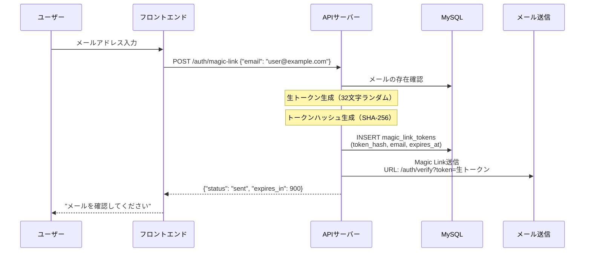
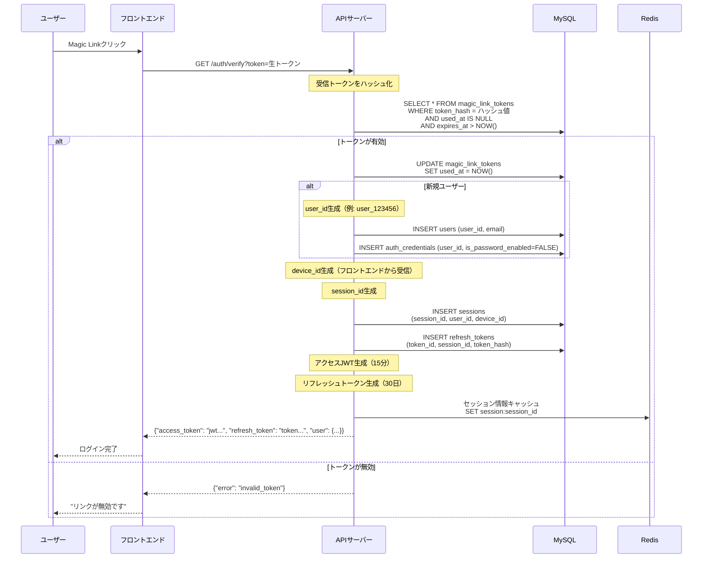
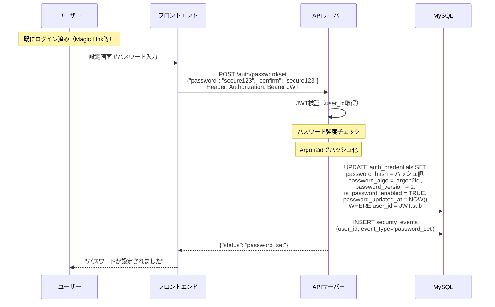
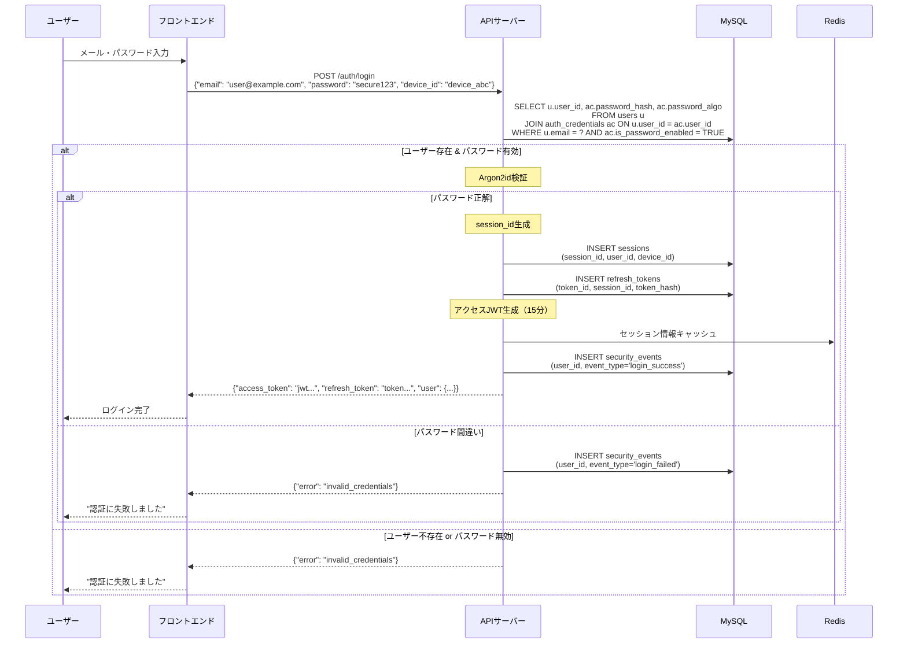
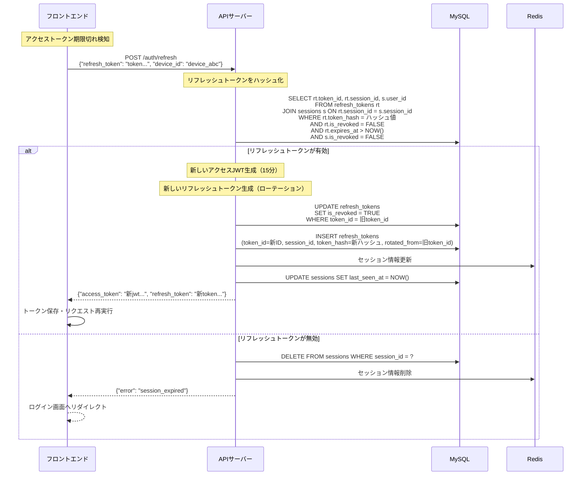
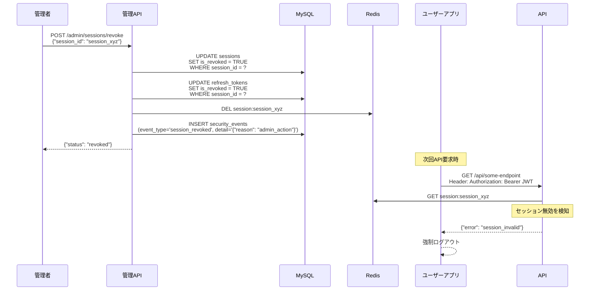
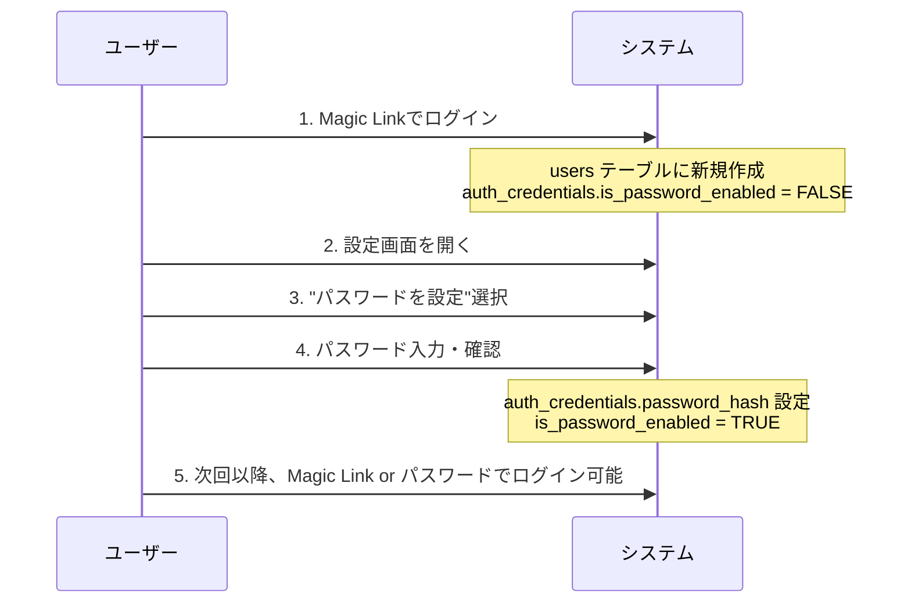
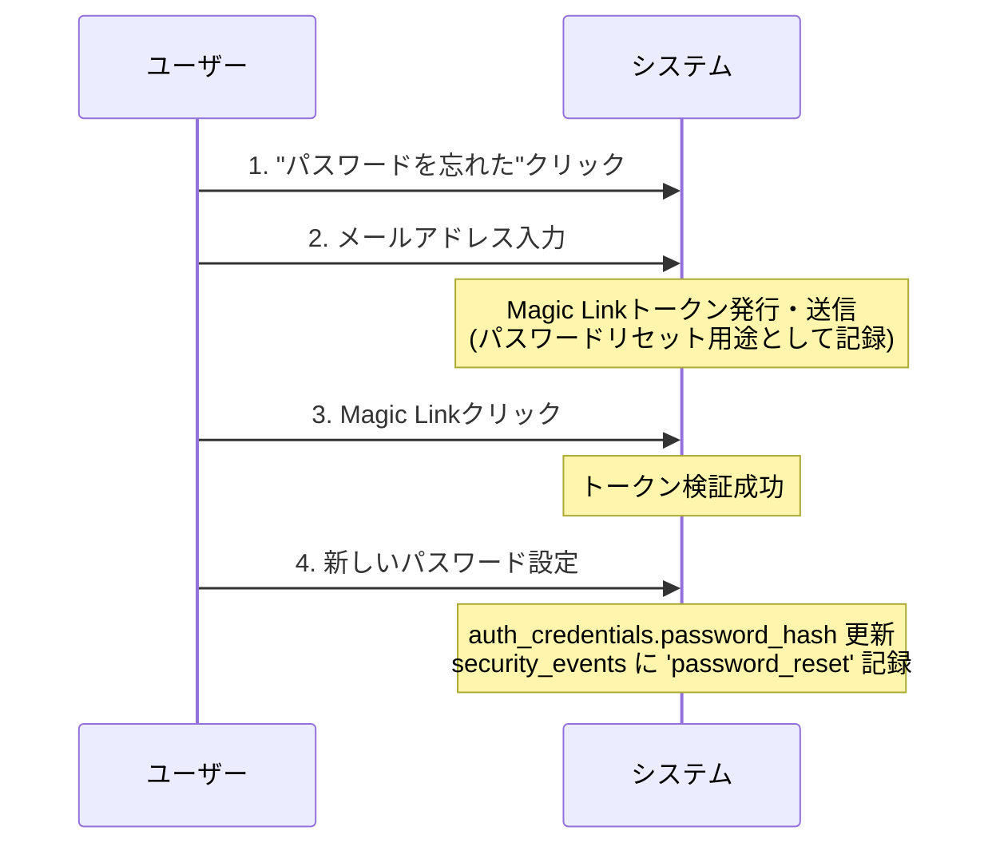

# じゃんけんバトル - 認証システム全体フロー

## 概要

本システムは**Magic Link認証**を主軸とし、**パスワード認証**を非常口として提供する、現代的な認証システムです。
JWTトークンベースのセッション管理により、複数端末での同時ログインと細かい制御が可能です。

## 認証方式の組み合わせ

| 認証方式 | 用途 | 必須度 | 特徴 |
|---------|------|--------|------|
| Magic Link | メイン認証 | 必須 | パスワードレス、メールベース |
| JWT (Access + Refresh) | セッション管理 | 必須 | 短期+長期トークンの組み合わせ |
| パスワード認証 | 非常口 | 任意 | 従来方式、設定で有効化 |

---

## 1. Magic Link認証フロー

### 1.1 Magic Link発行（ログイン開始）



**データ保存例:**
```sql
-- magic_link_tokens テーブル
INSERT INTO magic_link_tokens (
    token_hash,    -- SHA-256(生トークン) 
    email,         -- "user@example.com"
    user_id,       -- 既存ユーザーの場合のみ
    issued_at,     -- 現在時刻
    expires_at,    -- 15分後
    ip_address,    -- リクエスト元IP
    user_agent     -- ブラウザ情報
);
```

### 1.2 Magic Link認証（ログイン完了）



---

## 2. パスワード認証フロー

### 2.1 パスワード設定（初回 or 変更）



### 2.2 パスワードログイン



---

## 3. JWTトークン管理フロー

### 3.1 アクセストークン更新（リフレッシュ）



### 3.2 セッション強制終了



---

## 4. 複合認証シナリオ

### 4.1 Magic Link → パスワード設定の流れ



### 4.2 パスワードリセットの流れ



---

## 5. セキュリティ機能

### 5.1 ブルートフォース攻撃対策

```sql
-- 直近30分間の失敗試行をカウント
SELECT COUNT(*) as failed_attempts
FROM security_events 
WHERE event_type = 'login_failed' 
    AND ip_address = ?
    AND created_at > DATE_SUB(NOW(), INTERVAL 30 MINUTE);

-- 5回以上失敗している場合はアクセス拒否
-- Redisでレート制限も併用推奨
```

### 5.2 同時ログイン端末数制限

```sql
-- ユーザーのアクティブセッション数確認
SELECT COUNT(*) as active_sessions
FROM sessions 
WHERE user_id = ? 
    AND is_revoked = FALSE;

-- 上限（例：5台）を超える場合は最古のセッションを無効化
UPDATE sessions 
SET is_revoked = TRUE 
WHERE session_id IN (
    SELECT session_id FROM (
        SELECT session_id 
        FROM sessions 
        WHERE user_id = ? AND is_revoked = FALSE 
        ORDER BY last_seen_at ASC 
        LIMIT 1
    ) as oldest
);
```

### 5.3 JWTブラックリスト（即時失効）

```sql
-- 緊急時のJWT無効化
INSERT INTO jwt_blacklist (jti_hash, user_id, reason, expires_at)
VALUES (SHA2(?, 256), ?, 'security_incident', ?);

-- API要求時のJWT検証
SELECT 1 FROM jwt_blacklist 
WHERE jti_hash = SHA2(?, 256) 
    AND expires_at > NOW();
```

---

## 6. Redis活用パターン

### 6.1 セッションキャッシュ

```redis
# セッション情報のキャッシュ（TTL: アクセストークンと同期）
SET session:session_123 '{"user_id":"user_456","device_id":"device_abc","last_seen":"2024-01-01T12:00:00Z"}' EX 900

# WebSocket接続管理
SET websocket:user_456 '{"session_id":"session_123","socket_id":"socket_789"}' EX 3600
```

### 6.2 レート制限

```redis
# Magic Link送信制限（同一メールアドレス）
SET ratelimit:magiclink:user@example.com 1 EX 60  # 1分間に1回

# ログイン試行制限（IPアドレス）
INCR ratelimit:login:192.168.1.100 EX 1800  # 30分間で試行回数カウント
```

---

## 7. 運用・監視

### 7.1 定期クリーンアップ

```sql
-- 期限切れトークンの削除（日次実行）
DELETE FROM magic_link_tokens WHERE expires_at < DATE_SUB(NOW(), INTERVAL 1 DAY);
DELETE FROM refresh_tokens WHERE expires_at < NOW() AND is_revoked = TRUE;
DELETE FROM jwt_blacklist WHERE expires_at < NOW();

-- 古いセキュリティイベントの削除（月次実行）
DELETE FROM security_events WHERE created_at < DATE_SUB(NOW(), INTERVAL 6 MONTH);
```

### 7.2 監視対象メトリクス

- **アクティブセッション数**: `SELECT COUNT(*) FROM sessions WHERE is_revoked = FALSE`
- **Magic Link使用率**: `security_events`の`magic_link_used`イベント
- **パスワード設定率**: `auth_credentials`で`is_password_enabled = TRUE`の割合
- **異常ログイン**: 短時間での多地点ログイン、深夜帯のアクセス等

---

## 8. エラーハンドリング

| エラーケース | HTTPステータス | レスポンス | 対応 |
|-------------|---------------|------------|------|
| Magic Link期限切れ | 400 | `{"error": "token_expired"}` | 再送信を促す |
| セッション無効 | 401 | `{"error": "session_invalid"}` | 再ログインへ誘導 |
| リフレッシュトークン無効 | 401 | `{"error": "session_expired"}` | ログイン画面へ |
| パスワード強度不足 | 400 | `{"error": "weak_password"}` | 強化を要求 |
| レート制限 | 429 | `{"error": "rate_limited"}` | 待機時間を表示 |

この認証システムにより、ユーザビリティとセキュリティを両立した、拡張性の高い認証基盤が構築できます。
